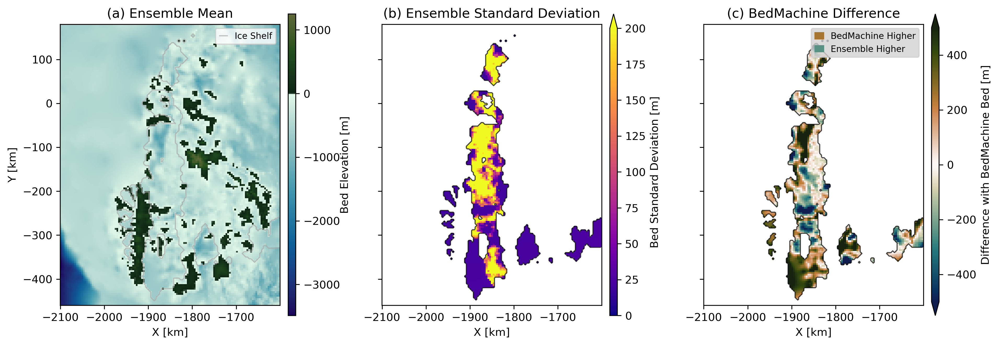
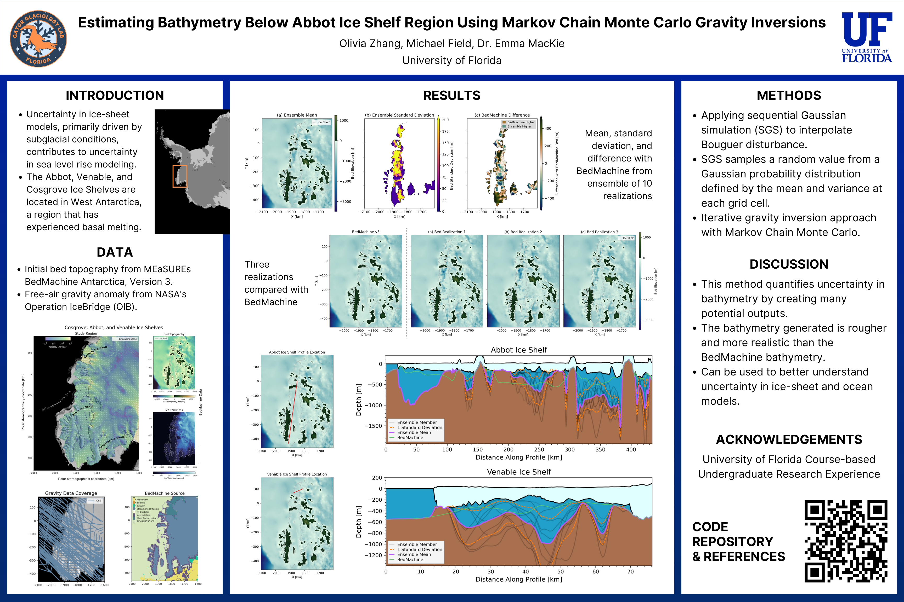

# Estimating bathymetry below Abbot Ice Shelf region using Markov chain Monte Carlo gravity inversions
A research project I worked on as part of Geophysical Exploration of the Cryosphere, a Course-based Undergraduate Research Experience at the University of Florida, in Fall 2024.



Uncertainty in ice-sheet models, primarily driven by subglacial conditions, contributes to uncertainty in sea level rise modeling. We apply an iterative gravity inversion approach with Markov Chain Monte Carlo to quantify uncertainty in the bathymetry of ice shelves in Antarctica, creating multiple, more realistic realizations of the seafloor beneath ice shelves.

# Methods
The data used for this research, located in the `data` folder, includes initial bed topography from [MEaSUREs BedMachine Antarctica, Version 3](https://nsidc.org/data/nsidc-0756/versions/3) and free-air gravity anomaly from [NASA's Operation IceBridge](https://icebridge.gsfc.nasa.gov/) (OIB).

In the `code` folder, `data_processing.ipynb` was used to crop and process the BedMachine bed topogarphy and OIB gravity data to the region of the Abbot, Cosgrove, and Venable Ice Shelves in West Antarctica. Then, `sgs_inversions.py` was used to run multiple inversions using the data. The other files in the `code` folder define functions that are utilized for the data processing and inversions. Below is an example of running the `sgs_inversions.py` code from the command line:
```
python sgs_inversions.py --path path_to_results --ninvs 10
```

# Research Poster
We presented our research through a poster session as part of the course.

